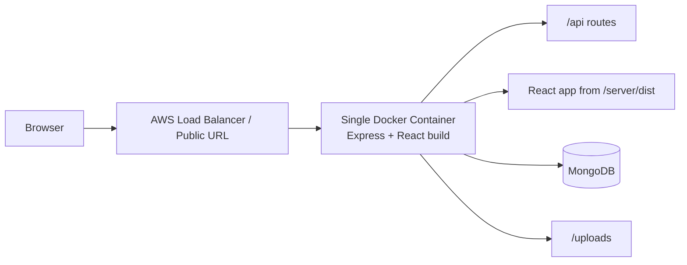

# YouTube Clone (MERN)

Full stack YouTube Clone built with React + Node/Express + MongoDB.

The project is already structured to run the frontend and backend from the same Express port in production:

- React builds into `server/dist`
- Express serves the static frontend from `server/dist`
- API routes stay under `/api`
- The container exposes only one port, `3000`

## Features

- JWT authentication (signup/login)
- Responsive frontend (mobile/tablet/desktop)
- Sticky navbar + sidebar layout
- Home video feed with search
- Watch page with likes and comments
- Upload page (video + thumbnail via multer)
- Channel page with subscribe/unsubscribe
- NotebookLM-style AI assistant for video summaries, notes, and Q&A
- REST APIs for auth, videos, comments, likes, and subscriptions

## Project Structure

- `client/` React frontend (Vite)
- `server/` Express backend + MongoDB (Mongoose)

## Environment Setup

### Backend (`server/.env`)

Copy `server/.env.example` to `server/.env` and update values:

```env
PORT=3000
MONGO_URI=mongodb://127.0.0.1:27017/youtube_clone
JWT_SECRET=replace_with_strong_secret
CLIENT_URL=http://localhost:3000
PEXELS_API_KEY=your_pexels_api_key_here
OPENAI_API_KEY=your_openai_api_key_here
OPENAI_MODEL=gpt-4.1-mini
```

### Frontend (`client/.env`)

Copy `client/.env.example` to `client/.env`:

```env
VITE_API_URL=http://localhost:3000/api
VITE_SERVER_URL=http://localhost:3000
```

## Run Locally

### 1) Start backend

```bash
cd server
npm install
npm run dev
```

### 2) Start frontend

```bash
cd client
npm install
npm run dev
```

Frontend: `http://localhost:5173`
Backend: `http://localhost:3000`

### Useful commands

```bash
npm run install:all
npm run build
npm start
```

### Run With Docker

For the frontend and backend to share the same port and still fetch data, run the app with MongoDB using Docker Compose:

```bash
docker compose up --build
```

App URL: `http://localhost:3000`

## Render Deployment

This repo is ready for a single Render web service using the root `render.yaml`.

1. Push the repo to GitHub.
2. Create a new Render Web Service from the repo root.
3. Let Render use the Dockerfile and blueprint in this repo.
4. Set the required secrets when prompted:
   - `MONGO_URI`
   - `PEXELS_API_KEY`
   - `OPENAI_API_KEY`
   - `GEMINI_API_KEY`

Render generates `JWT_SECRET` automatically from the blueprint. Uploaded files are stored on the persistent disk mounted at `/app/server/uploads`.

If you later use a custom frontend domain, set `CLIENT_URL` to that origin. For the Render-hosted app, the backend already allows localhost and `*.onrender.com` origins.

## AWS / ECR Deployment

This repo is suitable for a single Docker image in ECR. The backend serves both the API and the built frontend on the same port, so you can run one container in ECS or another AWS service and publish only `3000`.

Recommended flow:

1. Build the Docker image from the repo root.
2. Push that image to ECR.
3. Run it in ECS, App Runner, or EC2 with port `3000` exposed.
4. Point `MONGO_URI`, `JWT_SECRET`, and `CLIENT_URL` to your production values.

Architecture:



If you keep frontend and backend inside the same container, the frontend should call the API with relative URLs like `/api`, which is already how this repo is configured by default.

For local frontend development:

```bash
cd client
npm run dev
```

For local backend development:

```bash
cd server
npm run dev
```

### Important note

This project serves uploaded files from the app runtime. That works for the deployed demo flow, but for long-term persistent uploads you should move media storage to a cloud service such as Cloudinary, S3, or EFS.

## API Endpoints

### Auth
- `POST /api/auth/signup`
- `POST /api/auth/login`
- `GET /api/auth/me` (protected)

### Videos
- `GET /api/videos`
- `GET /api/videos?search=query`
- `GET /api/videos/:id`
- `GET /api/videos/channel/:channelId`
- `POST /api/videos/upload` (protected, multipart: `video`, `thumbnail`)
- `PATCH /api/videos/:id/like` (protected)

### Notebook AI
- `GET /api/notebook/:videoId`
- `POST /api/notebook/:videoId/summary`
- `POST /api/notebook/:videoId/question`
- `POST /api/notebook/:videoId/notes`
- `DELETE /api/notebook/:videoId/notes/:noteId`

### Comments
- `GET /api/comments/:videoId`
- `POST /api/comments/:videoId` (protected)
- `PATCH /api/comments/like/:commentId` (protected)

### Users / Channel
- `GET /api/users/channel/:channelId`
- `PATCH /api/users/subscribe/:channelId` (protected)
